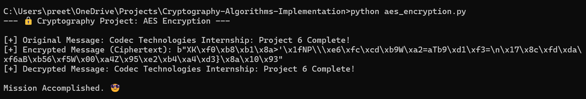
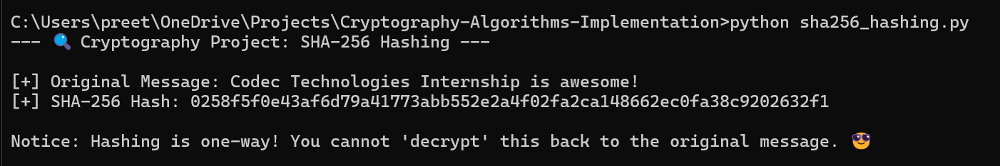
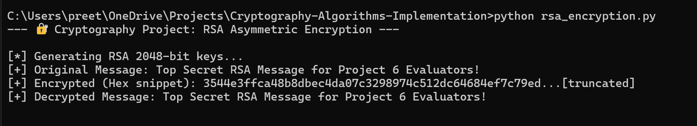

# Cryptography Algorithms Implementation using Python 🛡️

This repository contains my submission for **Project 6** of the Codec Technologies Internship. 
It demonstrates the implementation of three fundamental cryptographic concepts:

## Included Algorithms:
1. **AES Encryption (`aes_encryption.py`)**: Demonstrates **Symmetric Encryption** where the same 128-bit key is used to both encrypt and decrypt data.
2. **RSA Encryption (`rsa_encryption.py`)**: Demonstrates **Asymmetric Encryption** utilizing a 2048-bit Public/Private key pair for highly secure data transmission.
3. **SHA-256 Hashing (`sha256_hashing.py`)**: Demonstrates cryptographic **Hashing**, creating a fixed-size, irreversible, unique digital fingerprint of a string of text.

### How to Run:
Ensure you have the `pycryptodome` library installed:
`pip install pycryptodome`

Run any of the Python scripts directly in your terminal to see the encryption, decryption, and hashing processes in action!

### 📸 Execution Screenshots

#### 1. AES Encryption Output

#### 2. SHA-256 Hashing Output

#### 3. RSA Encryption Output
